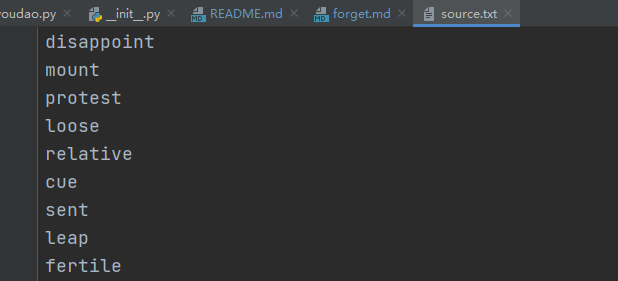

# MissZhang
在我初中和高中的时候，都有个英语听写这一环节在每一单元的学习中。我的两任英语老师都姓张。现在每当我需要对我英语单词听写的时候，我总会想到MissZhang.

这个项目现在实在是太简单了,或者说现在还不是一个项目，它只是一个简单的程序，这就敢传到Github实在是不知羞耻。但是我的脑子里还有很需求和想法。
我打算长期完善它，希望它能帮助到更多的人。

## Usage
首先，你需要在你的python中安装playsound，它将用于播放单词的音频。可以直接使用pip安装：
```shell
pip install playsound
```

接下来你就可以开始使用了！

:one: 首先，你需要在source.txt文件中输入你要听写的单词，就像这样：


程序会按照此文件的内容从有道词典中获取相应的音频。

:warning:
<font color=red>
请务必保证单词拼写的正确性，这是由于有道词典所提供的api对输入的任何内容都会返回一个音频。
你可将单词先输入到excel等具有英文拼写检查功能的编辑器中，待审核完毕后再输入到source文件里。
</font>

:two:

**下面我们就可以使用了，程序开始运行后会进行初始化操作：**


**之后我们便可以输入：**


如果你忘记单词如何拼写只需按下回车或者随便输入一些再按回车。当然，按照提示你可以输入x来进入下一个单词
而这个单词会在之后某一次中重新播放：


**你没有拼写正确或没有拼写的单词会被输入到forget.md文件中**